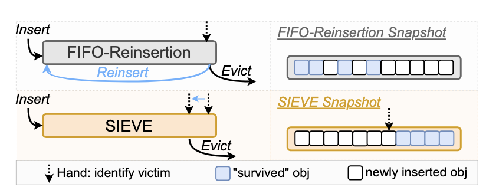
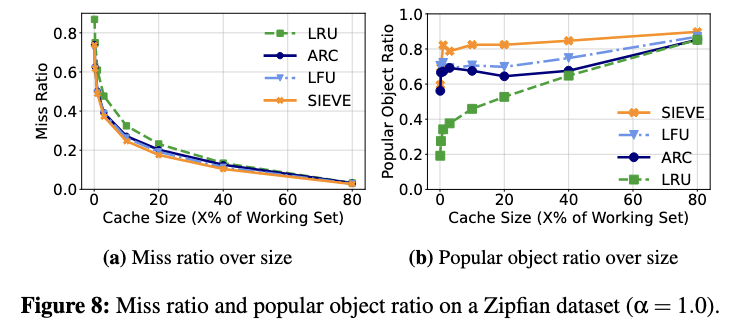
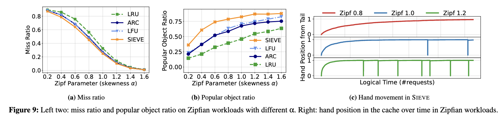
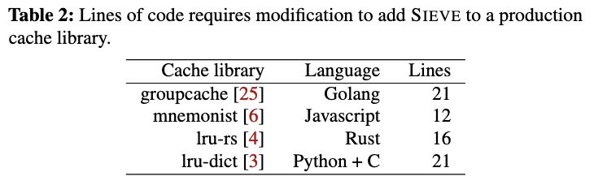
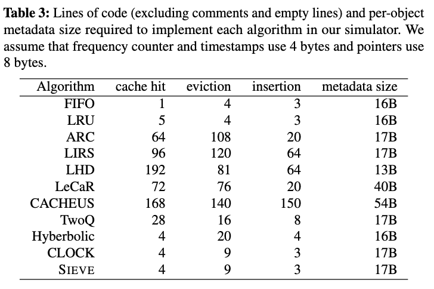
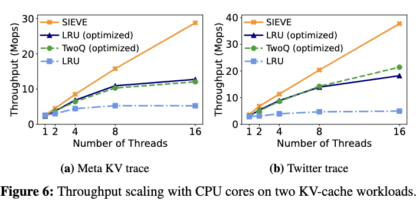

# SIEVE is Simpler than LRU: an Efficient Turn-Key Eviction Algorithm for Web Caches
_August 29, 2025_

[Link to Paper](https://www.usenix.org/system/files/nsdi24-zhang-yazhuo.pdf)

[TOC]<!-- toc -->

## Research Question

Is it possible to have a cache-replacement algorithm for typical (Zipfian distributed) web workloads which is simultaneously:

- Efficient (high hit rate/low miss rate)
- Simple (easy to implement)
- Scalable (in terms of concurrency)

..?

## Background

(&sect;2.2)

> Over the years, new cache eviction algorithms have gradually convoluted. Algorithms from the 1990s use two or more static LRU queues or use different recency metrics; algorithms from the 2000s employ size-adaptive LRU queues or use more complicated recency/frequency metrics, and algorithms from the 2010s and 2020s start to use machine learning to select eviction candidates. Each decade brought greater complexity to cache eviction algorithms. Nevertheless, as we show in §4, while the new algorithms excel on a few specific traces, they do not show a significant improvement (and some are even worse) compared to the traditional ones on a large number of workloads. The combination of limited improvement and high complexity explains why these algorithms have not been used in production systems.

(&sect;2.3)

> Promotion and demotion are two cache internal operations used to maintain the logical ordering between objects... 
>
> **Lazy promotion** refers to the strategy of promoting cached objects only at eviction time. It aims to retain popular objects with minimal effort... Lazy promotion can improve (1) throughput due to less computation and (2) efficiency due to more information about an object at eviction.
>
> **Quick demotion** removes most objects quickly after they are inserted.

Most cached items fall into two categories: _hot_ or _one-hit wonders_.  

### Questions

Which of the three desirable properties does Lazy promotion help support?

  Scalability.  This is the reason that LRU is not scalable: in selecting eager promotion (moving each item to the head of the list every time it is accessed), it requires memory writes and possibly synchronization on each access.  In contrast, CLOCK and SIEVE, since they only set a bit on access (if not already set), often require no stores and can use simple atomics.

When is quick demotion helpful?

When there are a lot of one-hit wonders; this is true of long-tailed power law distributed (Zipfian) cache workloads, like web traffic.

## Approach

#### Metadata

- FIFO queue of cached items
  - Newly cached items inserted at head
  - Evicted items removed from middle (at the position of "Hand")
- "Recently accessed" bit per item
- "Hand" pointer
  - Moves from tail to head, eating accessed bits and stale items like Pac-man

#### Insertion

1. Insert at head of FIFO
2. Evict if necessary

#### Access

1. If recently accessed bit not set, set it

#### Eviction

1. Look at item pointed to by "Hand" (Pac-man):
   1. If recently accessed bit not set, evict/remove 
   2. Else clear recently accessed bit
2. Move Pac-man one item towards the head
3. If Pac-man falls off the end (head) of the queue, return to the tail

### Questions

How does SIEVE support lazy promotion?

Items are never moved; only their access bit is changed, and only if it is not in the desired state.  The access bit defines two priorities: hot or cold.  An item is only evicted in one of two cases: <ol>
  <li>Pac-man has travelled the entire queue and returned to the same position without anyone accessing the item</li>
  <li>The item was recently inserted and not accessed before Pac-man ate it</li>
  </ol> 
  

How could SIEVE be implemented using a ring buffer (instead of the more obvious linked-list)?

## Evaluation

(&sect;5)

> Our empirical evaluation shows that SIEVE is simultaneously simple, fast, scalable, and efficient. **In a well-trodden field like cache eviction, SIEVE’s competitive performance was a genuine surprise to us as well.** We next report our analysis that seeks to understand the secrets behind its efficiency.

### Efficiency

### Simplicity

### Scalability

## Interesting/Notable

- Importance of avoiding memory writes for scalability!
- New compelling result in such an old and well-studied subject!
- Emphasis on simplicity/implementability
- Surprise results: interesting paper structure: 
  - Background
  - Presentation of new idea
  - Evaluation
  - Extended analysis of unexpected result
  - Application of SIEVE as primitive in other more complicated algorithms

## Ideas

- Could the datasets they reference be useful in observability or key-value database evaluations?
  - Three large datasets CDN1, CDN2 and Twitter
